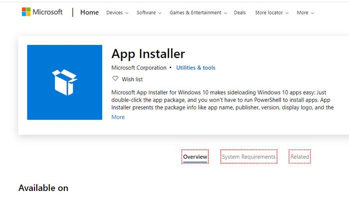

# **This is Winget tutorial.**

To get more information, follow this link: https://aka.ms/winget-command-help

**Winget** is a command line tool of **Windows Package Manager**.

-   **Windows Package Manager** is a comprehensive package manager solution that consists of a command line tool and set of services for installing applications on Windows 10 and Windows 11.

-   Developers use the winget command line tool to discover, install, upgrade, remove and configure a curated set of applications on Windows 10 and Windows 11 computers. This tool is the client interface to the **Windows Package Manager** service. After it is installed, developers can access winget via the Windows Terminal, PowerShell, or the Command Prompt.

- **Windows Package Manager** winget command-line tool is available on Windows 11 and modern versions of Windows 10 as a part of the App Installer.

# **Install winget**

Windows Package Manager **winget** command-line tool is available on Windows 11 and modern versions of Windows 10 as a part of the **App Installer**.

You can get App Installer from the Microsoft Store. If it's already installed, make sure it is updated with the latest version.



You can check the winget version to make sure it's installed completely

```console
winget --version
```
or
```console
winget -v
```